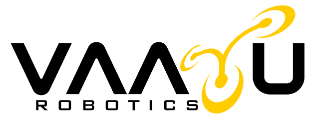

  

<h1 align="center">🌬️ VAAYU ROBOTICS</h1>
<h3 align="center">Advanced Drone Solutions | Aerial Intelligence | Engineering Excellence</h3>

  <strong>Transforming aerial data into powerful insights through precision drone technology.</strong>

---

## 🚁 About Vaayu Robotics
**Vaayu Robotics** is a next-generation aerial intelligence company specializing in drone-based surveying, inspection, monitoring, and data analysis.  
We deliver high-accuracy, fast, safe, and cost-efficient solutions for industries including construction, power, solar, disaster management, agriculture, and more.

Our mission is simple:  
**To revolutionize how businesses capture, analyze, and use aerial data — with unmatched precision and innovation.**

---

## 🎯 Vision — Mission — Values

### 🌟 **Vision**
To become India’s most trusted and advanced provider of drone-based solutions.

### 🚀 **Mission**
Deliver high-accuracy aerial insights that empower industries to make smarter and faster decisions.

### 💠 **Core Values**
- **Safety First**
- **Innovation Driven**
- **Quality Assured**
- **Client-Centric Approach**

---

## 🌐 Live Website  
🔗 **https://vaayuu-roboticss.vercel.app/**

---

## ✨ Key Highlights of the Website  
*Built using pure HTML, CSS & JavaScript — no frameworks, clean, fast & optimized.*

### 🎨 **Premium User Experience**
- Smooth scroll animations  
- Clean modern dark-themed UI  
- Yellow accent highlight branding  
- Video-enabled service cards  
- Professional page structure across 15+ pages  

### 📱 **Responsiveness**
- Fully responsive on mobile, tablet & desktop  
- Touch-friendly navigation  
- Dynamic layout adjustments  

### 🎞️ **Media-Rich Interface**
- Drone videos, hero banners, intro videos  
- High-quality industrial images  
- PDF booklets for detailed info  

---

## 🧩 Full Website Pages

index.html
about.html
company.html
contact.html
faq.html
agriculture.html
construction.html
powerline.html
solar.html
consultation.html
disaster.html
oilgas.html
road.html
seva.html

yaml
Copy code

Each page is professionally designed for the related service.

---

## 🏗️ Project Structure (HTML + CSS + JS)

### **Root Structure**
├── index.html
├── about.html
├── company.html
├── contact.html
├── faq.html
├── agriculture.html
├── construction.html
├── powerline.html
├── solar.html
├── consultation.html
├── disaster.html
├── oilgas.html
├── road.html
├── seva.html
├── assets/
│ ├── logo.png
│ ├── *.png (service images)
│ ├── *.jpg (high-resolution drone images)
│ ├── .pdf (company brochures)
│ ├── drone-video.mp4
│ └── hero-.png
└── style.css

yaml
Copy code

---

## 🛠️ Technology Stack

### **Frontend**
- **HTML5** — Semantic & structured  
- **CSS3** — Animations, effects, responsiveness  
- **JavaScript (ES6)** — Menus, interactions, video controls  

### **UX / Design**
- Dark premium theme  
- Yellow accent (#FFCF14)  
- Clean typography  
- Hero sections with layered depth  

---

## 🚀 Services We Provide

### 🏗️ **Construction Monitoring**
Real-time site progress, volume analysis, 3D mapping & project tracking.

### ⚡ **Powerline Inspection**
Drone-based fault detection, thermal imaging & structural monitoring.

### ☀️ **Solar Plant Inspection**
Module-level inspection and performance analytics.

### 🚜 **Agriculture Monitoring**
Crop health analysis, NDVI mapping & yield optimization.

### 🛢️ **Oil & Gas Pipeline Inspection**
High-risk zone monitoring, leak detection, and route surveillance.

### 🛣️ **Road Inspection**
High-accuracy road condition assessment.

### 🚨 **Disaster Management**
Emergency mapping & real-time situational awareness.

### 🎓 **Consultation & Training**
Professional drone operation training.

---

## 📊 Company Achievements
- **1000+ Kilometers Covered**  
- **1000+ Flying Hours**  
- **1000+ Successful Projects**  

---

## 🎬 Media & Assets Used

### **Images**
- Company hero graphics  
- Service category images  
- Industrial aerial shots  

### **Videos**
- drone-video.mp4  
- Intro animations for services  

### **PDF Booklets**
- Construction  
- Transmission Lines  
- Real Estate  
- Agriculture  
- Solar Farms  

### **Logo**
- `assets/logo.png`

---

## 🎨 Design Language

### **Color Palette**
| Color | Hex |
|-------|---------|
| Primary Black | #000000 |
| Pure White | #FFFFFF |
| Accent Yellow | #FFCF14 |

### **Typography**
- **Primary:** Antonio (Bold & Clean)  
- **Secondary:** System UI fonts  

### **UI Effects**
- Hover animations  
- Video-on-hover sections  
- Smooth sections transition  

---

## 🛡️ Security & Optimization
- Minified images  
- Clean and valid HTML5  
- Secure external assets  
- Performance-optimized video usage  

---

## 📧 Contact
For collaborations or project inquiries:  
🌐 Website: https://vaayu-robotics.netlify.app  
📩 Contact via form: `/contact.html`  

---

  <h3>🌬️ Vaayu Robotics — Shaping Tomorrow From the Sky 🚁</h3>
  <strong>© 2025 Vaayu Robotics. All Rights Reserved.</strong>

